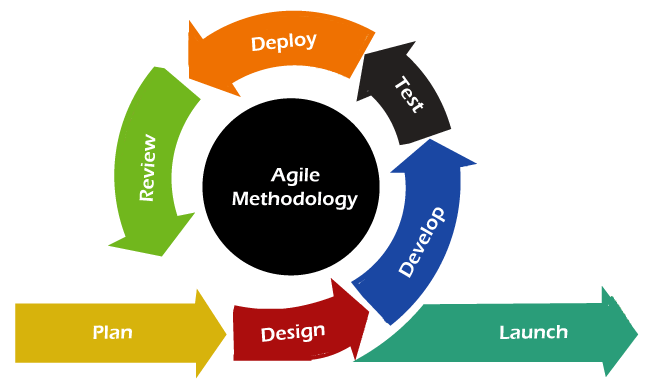

# SE-Assignment-2
Assignment: Introduction to Software Engineering
Instructions:
Answer the following questions based on your understanding of software engineering concepts. Provide detailed explanations and examples where appropriate.

Questions:
1. Define Software Engineering:

    _**Software engineering**_ is a **engineering discipline** thay is mainly focused on the **systematic approach** to the design, development, testing, and maintenance of software systems. It integrates **engineering principles** with programming knowledge to **produce efficient, reliable, and maintainable software applications.** This field encompasses a wide range of activities such as **coding, including requirements analysis, software architecture, project management, and quality assurance.**Software engineers apply their expertise across various domains, such as computer games, business applications, operating systems, network control systems, and more, contributing significantly to industries like healthcare, finance, manufacturing, education, and government. Software engineering is characterized by its commitment to producing high-quality software that meets user needs efficiently and effectively, leveraging continuous learning and adaptation to new technologies and methodologies. 

2. What is software engineering, and how does it differ from traditional programming?

_**Software engineeting**_ is an engineering discpline that focuses on using a systematic way to systematically design, develop, test, and maintain software systems and applications ensuring that it addresses both the technical aspects of software creation and factors such as project management, quality assurance, and the integration of software within larger systems or environments. 
**software engineering is a discipline that extends beyond mere programming to encompass the entire software development lifecycle, emphasizing quality, adaptability, and stakeholder engagement. This comprehensive approach aims to produce robust, maintainable, and user-friendly software solutions**

**This are the differences between Software engineering and Traditional Programming**

| Software engineering | Traditional Programming |
| ---------------------|:-----------------------:|
| Software engineering encompasses the entire lifecycle of a software project, from initial concept through to deployment and maintenance        | Traditional programming, on the other hand, tends to focus more narrowly on the coding aspect of software development.|
| Software engineering often employs structured methodologies and frameworks, such as Agile or Waterfall, to manage the development process. These methodologies aim to deliver high-quality software efficiently and effectively            | Traditional programming might rely more heavily on individual coding skills and less on formalized methodologies.   |
| Quality assurance is a core component of software engineering, with practices designed to identify and eliminate defects early in the development cycle           | Traditional programming may place less emphasis on QA, focusing instead on getting the software to function correctly.     |
| Software engineering processes are generally more adaptable, allowing for changes in requirements and design throughout the development process. | Traditional programming, especially under certain methodologies, might be less flexible, with changes being more challenging to incorporate once development has started. |

3. Software Development Life Cycle (SDLC):

4. Explain the various phases of the Software Development Life Cycle. Provide a brief description of each phase.

**Software Development Life Cycle (SDLC)** - is a systematic process used by software engineers and developers to design, develop, test, and deploy high-quality software. The SDLC **aims to produce software that meets or exceeds customer expectations**, is completed within time and cost estimates, and is maintainable and scalable.

## **_Planning_**:
-  Defines the scope and purpose of the project.

**_Activities_**:

- Feasibility study to determine if the project is viable.

- Resource allocation including time, budget, and personnel.

- Risk assessment and management planning.

## **_Requirements Analysis_**

**Objective**:
-  Gather and analyze the business and technical requirements.

**Activities**:

- To intiate stakeholder interviews and surveys.
- Documenting functional and non-functional requirements.
- Creating requirement specifications and getting approval from stakeholders.

## **_Design_**

**Objective**:

 To define the architecture and design of the system.

**Activities**:

- Creating high-level and detailed design documents.
- Database design and user interface design.
- Defining system architecture, components, modules, and interfaces.

## **_Implementation (Coding)_**

**Objective**: 

- To convert the design documents into the actual software.

**Activities**:

- Writing the code in the chosen programming language.
- Unit testing and debugging.
- Integrating modules to ensure they work together as a whole.

## **_Testing_**

**Objective**: 

- To verify that the software works as intended and is free of defects.

**Activities**:
- Conducting various tests: unit testing, integration testing, system testing, and user acceptance testing (UAT).
- Identifying and fixing bugs.
- Ensuring the software meets all requirements.

## **_Deployment_**

**Objective**:
-  Release the software to production and make it available to users.

**Activities**:

- Deploying the software to the live environment.
- Conducting final testing and user training.
- Preparing deployment documentation and release notes.

**_Maintenance_**

**Objective**: 

- Provide ongoing support and improvements to the software.

**Activities**:

- Bug fixing and performance tuning.
- Adding new features and enhancements.
- Regular updates and patches.

Agile vs. Waterfall Models:

Compare and contrast the Agile and Waterfall models of software development. What are the key differences, and in what scenarios might each be preferred?
### **Agile Software Development**

Agile is an iterative approach to software development that emphasizes flexibility, collaboration, and customer satisfaction. It involves breaking down the project into smaller, manageable units that are developed incrementally. This allows for continuous feedback and adjustment throughout the project lifecycle.

## Waterfall Software Development

Waterfall is a linear and sequential approach to software development, where each phase of the project (requirements gathering, design, implementation, testing, and maintenance) is completed before moving on to the next. This methodology is characterized by its structured and predictable nature.

A TABLE TO COMPARE AND CONTRAST THE AGILE AND  WATERFALL MODELS

| Aspect | Agile Model | Waterfall Model |
| ------ | ----------- | --------------- |
| **Approach** | Iterative and incremental | Linear and sequential |
| **Flexibility** | Highly flexible; allows changes at any stage | Inflexible; changes are difficult to incorporate once a phase is completed |
| **Process** | Divided into small sprints or iterations | Divided into distinct phases (e.g., Requirements, Design, Implementation, Testing, Deployment, Maintenance) |
| **Requirements** | Evolving; requirements can change throughout the development process | Fixed; all requirements must be defined upfront before development begins |
| **Customer Involvement** | High; continuous feedback from the customer and stakeholders | Low; customer involvement mainly at the beginning (requirements phase) and at the end (delivery) |
| **Testing** | Continuous testing throughout the development process | Testing phase comes after the implementation phase is complete |
| **Documentation** | Minimal and just enough; focuses on delivering working software | Extensive; detailed documentation for each phase |
| **Risk Management** | Risks are identified and managed in each iteration | Risks are identified and managed at the beginning of the project |
| **Team Structure** | Cross-functional teams; collaboration is emphasized | Siloed teams; each team works on specific phases |
| **Delivery** | Frequent releases (e.g., every sprint) | Single release at the end of the project |

Requirements Engineering:

What is requirements engineering? 
_**Requirements engineering is the process of defining, documenting, and maintaining the requirements in the engineering design process. It is a critical step in the software development lifecycle (SDLC) that ensures the final product meets the needs and expectations of stakeholders.**_

Describe the process and its importance in the software development lifecycle.
1. **Requirements Elicitation**
   - **Objective**:To gather requirements from stakeholders, including users, customers, and other relevant parties.
   - **Methods**: Use interviews, surveys, workshops, observation, and document analysis to collect information.
   - **Output**: Initial set of requirements, often captured in a requirements document or backlog.

2. **Requirements Analysis**
   - **Objective**: Analyze and refine the gathered requirements to ensure they are complete, consistent, and feasible.
   - **Activities**: Identify ambiguities, conflicts, and redundancies. Prioritize requirements based on stakeholder needs and project constraints.
   - **Output**: Refined requirements with clear definitions and priorities.

3. **Requirements Specification**
   - **Objective**: Document the analyzed requirements in a detailed and structured format.
   - **Techniques**: Use natural language, use cases, user stories, and models (such as UML diagrams) to specify requirements.
   - **Output**: Formal requirements specification document that serves as a reference for development and testing.

4. **Requirements Validation**
   - **Objective**: Ensure the specified requirements accurately reflect stakeholder needs and are achievable.
   - **Methods**: Conduct reviews, inspections, walkthroughs, and prototyping with stakeholders.
   - **Output**: Validated requirements that have been agreed upon by stakeholders.

5. **Requirements Management**
   - **Objective**: Track and manage changes to requirements throughout the project lifecycle.
   - **Activities**: Use version control, change control processes, and requirements traceability matrices.
   - **Output**: Updated and managed requirements that remain aligned with project goals and stakeholder expectations.

## Importance of Requirements Engineering

- **Foundation for Development**: Provides a clear understanding of what needs to be built, guiding the design, implementation, and testing phases.
- **Stakeholder Alignment**: Ensures that the final product meets the needs and expectations of all stakeholders, reducing the risk of project failure.
- **Risk Reduction**: Identifies potential issues early in the project, allowing for proactive mitigation strategies.
- **Cost and Time Efficiency**: Prevents costly and time-consuming changes by identifying and addressing requirements issues early.
- **Quality Assurance**: Facilitates the development of a product that meets quality standards and performs reliably in real-world scenarios.
- **Communication**: Enhances communication and understanding among project team members and stakeholders through clear and structured documentation. evolves.

Software Design Principles:

Explain the concept of modularity in software design. How does it improve maintainability and scalability of software systems?

_**Modularity is the design principle that divides a software system into distinct, independent modules, each responsible for a specific functionality and task.Modularity is a powerful design principle that offers numerous benefits, including improved maintainability, scalability, reusability, and testability. By breaking down a software system into independent modules, developers can manage complex systems more effectively, enhance the quality of their software, and respond more efficiently to changing requirements. Embracing modularity leads to more robust, flexible, and maintainable software solutions.**_

### Benefits
#### Maintainability
-  Modularity significantly enhances maintainability. When a software system is divided into modules, each module can be updated, fixed, or enhanced without impacting the entire system. This isolation means that changes made in one module do not affect the others, reducing the risk of introducing new bugs into unrelated parts of the system. For example, if a bug is found in a specific module, developers can address it within that module without worrying about unforeseen consequences in other parts of the application.

#### Scalability
-  Scalability is another critical benefit of modularity. As software needs grow and evolve, new features or functionalities can be added by creating new modules or extending existing ones. This modular approach allows the system to scale efficiently without requiring extensive rework of the entire codebase. For instance, if a new feature is requested, developers can build it as a separate module and integrate it with the existing system, ensuring minimal disruption.

#### Reusability
-  Modularity promotes reusability by allowing modules to be reused across different projects. When a module is designed to perform a specific function well, it can be reused in various applications, saving development time and effort. For example, a module responsible for user authentication can be reused in multiple projects that require user login functionality, reducing the need to develop this feature from scratch for each new project.

#### Testability
-  Modularity enhances the testability of software systems. Independent modules can be tested separately, ensuring that each module functions correctly before integrating it with others. This isolation makes it easier to identify and fix issues within a specific module. For example, unit tests can be written to test the functionality of individual modules in isolation, and integration tests can be used to verify the interaction between modules. This modular testing approach improves the accuracy and efficiency of the testing process, leading to higher quality software.

Testing in Software Engineering:

Describe the different levels of software testing (unit testing, integration testing, system testing, acceptance testing). Why is testing crucial in software development?

Unit testing is the process of verifying the functionality of individual components or modules of a software application. Each unit, typically a single function or method, is tested in isolation to ensure it performs as expected. 

### Objectives
- **Isolation**: Test each part of the code independently to identify and fix issues at the earliest stage of development.
- **Correctness**: Verify that each unit produces the correct output for a given input.
- **Reliability**: Ensure that units are reliable and function correctly in isolation before they are integrated into larger systems.

### Benefits
- **Early Bug Detection**: Identifies issues early in the development process, making them easier and less costly to fix.
- **Simplified Debugging**: Since tests are isolated, it's easier to locate the source of a problem when a test fails.
- **Improved Code Quality**: Encourages developers to write modular, reusable, and maintainable code.

### Tools
- **Examples**: JUnit (Java), NUnit (.NET), PyTest (Python), Jasmine (JavaScript).

## 2. Integration Testing

### Detailed Explanation
Integration testing focuses on verifying the interactions between integrated modules. After individual units are tested, they are combined, and their interactions are tested to identify any issues that may arise when modules are integrated.

### Objectives
- **Interface Verification**: Ensure that different modules interact correctly through their interfaces.
- **Interaction Testing**: Test the flow of data and control between modules to detect integration issues.
- **System Behavior**: Validate that integrated modules work together as intended.

### Benefits
- **Early Detection of Integration Issues**: Identifies problems in the interaction between modules early in the integration phase.
- **Smooth Integration**: Ensures that modules integrate seamlessly, preventing major issues in later stages of development.
- **System Stability**: Contributes to the overall stability and reliability of the software system.

### Approaches
- **Top-Down**: Start testing from the top module and progressively integrate and test lower-level modules.
- **Bottom-Up**: Start testing from the bottom (leaf) modules and progressively integrate and test higher-level modules.
- **Big Bang**: Integrate all modules simultaneously and test them as a complete system.
- **Incremental**: Integrate and test modules incrementally, combining top-down and bottom-up approaches.

### Tools
- **Examples**: JUnit (Java), TestNG (Java), Protractor (JavaScript), PyTest (Python).

## 3. System Testing

### Detailed Explanation
System testing evaluates the complete and integrated software system to ensure it meets the specified requirements. It is performed after integration testing and before acceptance testing.

### Objectives
- **Requirement Validation**: Verify that the system meets the specified functional and non-functional requirements.
- **Performance Testing**: Assess the system's performance, including response time, throughput, and scalability.
- **Security Testing**: Check for vulnerabilities and ensure the system is secure against threats.

### Benefits
- **Comprehensive Testing**: Provides a thorough evaluation of the entire system, covering all functional and non-functional aspects.
- **User Perspective**: Tests the system from an end-user perspective, ensuring it behaves as expected in real-world scenarios.
- **Quality Assurance**: Ensures the system is ready for deployment and meets quality standards.

### Types of System Testing
- **Functional Testing**: Validates the system's functionality against the requirements.
- **Performance Testing**: Measures the system's performance under various conditions.
- **Security Testing**: Identifies vulnerabilities and ensures the system is secure.
- **Usability Testing**: Evaluates the user interface and user experience.
- **Compatibility Testing**: Ensures the system works across different environments and platforms.

### Tools
- **Examples**: Selenium (Web applications), JMeter (Performance), QTP/UFT (Functional), LoadRunner (Performance).

## 4. Acceptance Testing

Acceptance testing is the process of validating the software against user requirements and business needs. It is the final level of testing before the software is delivered to the end-users.

### Objectives
- **User Requirement Verification**: Ensure the software meets the acceptance criteria defined by the users and stakeholders.
- **Readiness for Deployment**: Validate that the software is ready for deployment and use in a production environment.
- **User Satisfaction**: Confirm that the software fulfills the business needs and provides a satisfactory user experience.

### Benefits
- **Stakeholder Confidence**: Builds confidence among stakeholders that the software meets their needs and is ready for use.
- **Final Validation**: Acts as a final check before the software goes live, ensuring it meets all requirements.
- **Reduced Risk**: Minimizes the risk of deploying a system that fails to meet user expectations.

### Types of Acceptance Testing
- **User Acceptance Testing (UAT)**: Conducted by end-users to verify that the software meets their needs and works as expected.
- **Operational Acceptance Testing (OAT)**: Ensures the software meets operational requirements, such as reliability, performance, and supportability.
- **Contract Acceptance Testing**: Validates that the software meets the terms and conditions specified in the contract.
- **Regulatory Acceptance Testing**: Ensures the software complies with regulatory and legal requirements.

### Tools
- **Examples**: TestRail (Test management), QTest (Test management), JIRA (Issue tracking and test management).

Version Control Systems:

What are version control systems, and why are they important in software development? Give examples of popular version control systems and their features.

_**Version control systems (VCS) are tools that help manage changes to source code over time. They track revisions, allowing multiple developers to collaborate on a project without overwriting each other's work.**_

### Importance
- **Collaboration**: Facilitates teamwork by allowing multiple developers to work on different parts of the project simultaneously.
- **Version Tracking**: Keeps a history of changes, making it easy to revert to previous versions if necessary.
- **Branching and Merging**: Supports branching to develop features or fixes in isolation and merging them back into the main codebase.
### Examples
-## 1. Git

### Overview
Git is a distributed version control system known for its speed, efficiency, and powerful branching and merging capabilities. It was created by Linus Torvalds in 2005 and has since become one of the most popular VCSs used by developers worldwide.

### Features
- **Distributed**: Every developer has a full copy of the repository, allowing them to work offline and independently.
- **Branching and Merging**: Git supports lightweight branching, making it easy to create, merge, and manage branches for feature development, bug fixes, and experiments.
- **Speed**: Git is optimized for performance, allowing users to work with large repositories and perform operations quickly.
- **Open Source**: Git is open-source software, meaning it is freely available for anyone to use, modify, and distribute.
- **Large Ecosystem**: Git has a vast ecosystem of tools, services, and integrations, including popular platforms like GitHub, GitLab, and Bitbucket.

### Platforms
- **GitHub**: A cloud-based platform for hosting Git repositories, collaborating on projects, and managing development workflows.
- **GitLab**: A web-based DevOps platform that provides Git repository hosting, CI/CD pipelines, and project management features.
- **Bitbucket**: Atlassian's Git solution, offering code collaboration, version control, and integration with other Atlassian tools like Jira and Confluence.

## 2. Subversion (SVN)

### Overview
Subversion, also known as SVN, is a centralized version control system that was originally developed as an alternative to the CVS (Concurrent Versions System). It provides a centralized repository where all project files and historical changes are stored.

### Features
- **Centralized Repository**: SVN uses a central server to store the entire history of the project, allowing developers to access and commit changes to a single location.
- **Atomic Commits**: SVN supports atomic commits, ensuring that changes to multiple files are applied as a single, consistent transaction.
- **Branching and Tagging**: While SVN supports branching and tagging, it typically requires more planning and coordination compared to distributed VCSs like Git.
- **Mature Toolset**: SVN has been around for a long time and has a mature toolset, including command-line clients, graphical interfaces, and integrations with IDEs.

### Usage
- SVN is often used in environments where a centralized workflow is preferred or required, such as large enterprises or organizations with strict security and compliance requirements.
- It is commonly used for version control of legacy projects or projects where migration to a distributed VCS is not feasible.

## 3. Mercurial

### Overview
Mercurial is a distributed version control system similar to Git, developed as an alternative to existing VCSs like CVS and SVN. It is designed to be easy to use and highly performant, with a focus on scalability and simplicity.

### Features
- **Distributed**: Like Git, Mercurial is a distributed VCS, allowing every developer to have a full copy of the repository and work independently.
- **Simplicity**: Mercurial aims to provide a simple and intuitive user experience, with straightforward commands and workflows.
- **Performance**: Mercurial is optimized for performance, with efficient handling of large repositories and fast operations.
- **Extensions**: Mercurial has a modular architecture that allows users to extend its functionality through a wide range of extensions such as Evolve which extends Mercurial's core functionality to support advanced features such as changeset evolution, history rewriting, and phase management. It introduces concepts like mutable history, obsolescence markers, and evolve markers to enable more flexible and powerful workflows
# Software Project Management

Software Project Management:

Discuss the role of a software project manager. What are some key responsibilities and challenges faced in managing software projects?

_**A software project manager is responsible for overseeing the planning, execution, and delivery of software projects, ensuring they are completed on time, within budget, and to the required quality standards.**_
- **Planning**: They define the project scope, objectives, timelines, and resources.
- **Coordination**: They manage the team members, tasks, and communication to ensure smooth project execution.
- **Risk Management**:They identify, assess, and mitigate risks that could impact the project's success.
- **Monitoring and Control**: They track the project progress, manage changes, and ensure adherence to the plan.
- **Stakeholder Management**:They also communicate with stakeholders to keep them informed and address their concerns bout the project.

### Challenges

- **Balancing Competing Demands**:They manage time, cost, and quality constraints effectively.
- **Team Dynamics**: They resolve conflicts and ensure effective collaboration among team members.
- **Adapting to Changes**: They handle changes in requirements and scope efficiently.
- **Effective Communication**: They maintain clear and consistent communication with all stakeholders.

Software Maintenance:

Define software maintenance and explain the different types of maintenance activities. Why is maintenance an essential part of the software lifecycle?

Software maintenance involves updating and modifying software after its initial deployment to correct faults, improve performance, or adapt to a changed environment.

### Types of Maintenance Activities

- **Corrective Maintenance**: Fixing bugs and errors reported by users or identified during operation.
- **Adaptive Maintenance**: Modifying the software to work in new or changed environments, such as new operating systems or hardware.
- **Perfective Maintenance**: Enhancing existing functionalities and adding new features to improve performance and usability.
- **Preventive Maintenance**: Making changes to prevent future problems, improve maintainability, and extend the software’s life.

### Example and Importance
Consider a popular mobile banking application used by millions of customers worldwide. After the initial development and successful launch of the application, regular maintenance becomes crucial to ensure its continued functionality, security, and performance. Maintenance tasks may include applying security patches to protect against emerging threats, optimizing code to improve performance, fixing bugs reported by users, and adding new features to meet evolving customer needs. Without regular maintenance, the application may become vulnerable to security breaches, suffer from performance issues, and lose its competitive edge in the market.

- **Continued Functionality**: Ensures the software remains functional and relevant to user needs.
- **Security**: Addresses vulnerabilities and enhances the security of the software.
- **Performance**: Improves the performance and efficiency of the software over time.
- **Adaptability**: Keeps the software compatible with new technologies and environments.

Ethical Considerations in Software Engineering:

What are some ethical issues that software engineers might face? How can software engineers ensure they adhere to ethical standards in their work?

- **Privacy**: Ensuring user data is collected, stored, and used responsibly.
- **Security**: Protecting software from malicious attacks and ensuring it does not harm users.
- **Intellectual Property**: Respecting copyright, patents, and other intellectual property rights.
- **Transparency**: Being honest about the software’s capabilities, limitations, and potential risks.

### Ensuring Ethical Standards

- **Adherence to Codes of Conduct**: Follow established professional codes of ethics, such as those from the ACM or IEEE.
- **Continuous Education**: Stay informed about ethical standards, laws, and best practices.
- **Stakeholder Engagement**: Consider the impact of software on all stakeholders and involve them in decision-making processes.
- **Ethical Review Boards**:

## _REFERENCES_:
- Pressman, R. S. (2014). Sofgit stware engineering: A practitioner's approach (8th ed.). McGraw-Hill Education.
- Martin, R. C. (2008). Clean code: A handbook of agile software craftsmanship. Prentice Hall.
- GeeksforGeeks Software Engineering Tutorials. (n.d.). Retrieved from https://www.geeksforgeeks.org/software-engineering/

Submission Guidelines:
Your answers should be well-structured, concise, and to the point.
Provide real-world examples or case studies wherever possible.
Cite any references or sources you use in your answers.
Submit your completed assignment by [due date].
